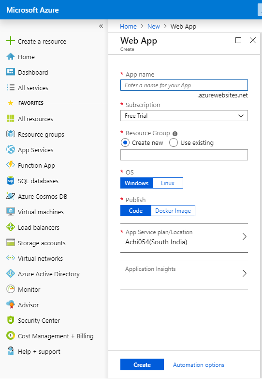

# Application Hosting
Hosting a web application in Microsoft Azure.

Steps to follow to host 
- Create a hosting environment in [Azure portal](https://portal.azure.com)
- Create the CI/CD pipeline in [Azure Dev](https://dev.azure.com)

## Creating the hosting environment
- Login to [Azure portal](https://portal.azure.com)
- Click on `Create a resource` in the left panel
- Search for `Web App` and select it
- Fill in all the necessary details and click `Create`<br/><br/>


- Once the resource is sucessfully created, click on `All resources` in the `Favourites` section in left panel.
- Click on the resource group created. You would see a `URL` defined for your resource <br/>
```
ex: https://<resource_name>.azurewebsites.net
```

## Create the CI/CD pipeline
- Login to [Azure Dev](https://dev.azure.com)
- Click on `Create project` on the top right panel
- Provide in the `Project name` and `Description`. Let the `Visibility` be `Private` and under `Advanced` section let the `Version control` be `Git` and `Work Item Process` be `Agile`
- Click on `Create`
- Select the resource create, Under `Pipelines` select `Builds`
<br/><br/>


- Click on `New pipeline`
- Select you Git Repository, the associated branch and Click `Continue`
- In the `Select a Template` page, you could select any templae that suites you programing language. Choose `Empty job`
- Select the `+` icon on the `Agent Job 1` of the center content. In the right panel select `.Net Core` .
- The .Net Core build and deployment process include
    - Restore
    - Build
    - Publish
- Create individual jobs for each by clicking on the `+` icon.
- The Restore job should look like below,<br/><br/>

- The Build job should look like below,<br/><br/>

- The Publish job should look like below,<br/><br/>

<br/>
- Click on `Save and queue`, a new job will be triggered
- To push artifacts to hosting site, Click on `Release` under `Pipelines` of left panel.
- Select `New pipeline`, Click on `Add an artifact` under `Artifacts`<br/><br/>

- Click on the first Stage link, authorize to Azure Portal hosting site.
- Select the `App service name` as the one creating on the hosting site.
- Click on `Release` under `Pipelines` and select the created release.
- Click on `deploy` 

[](https://dev.azure.com/O3BE/Dev%20Hosting/_build/latest?definitionId=2&branchName=master)
